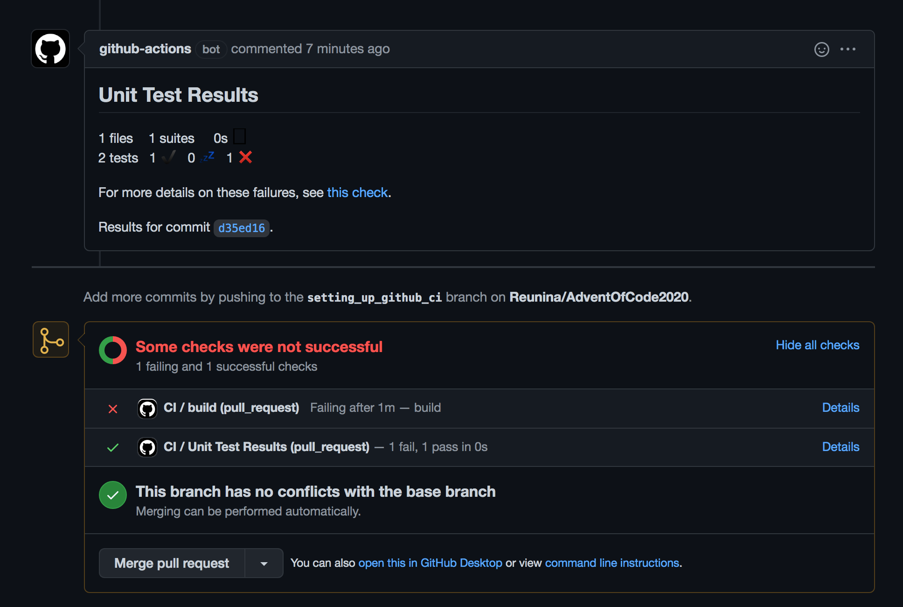
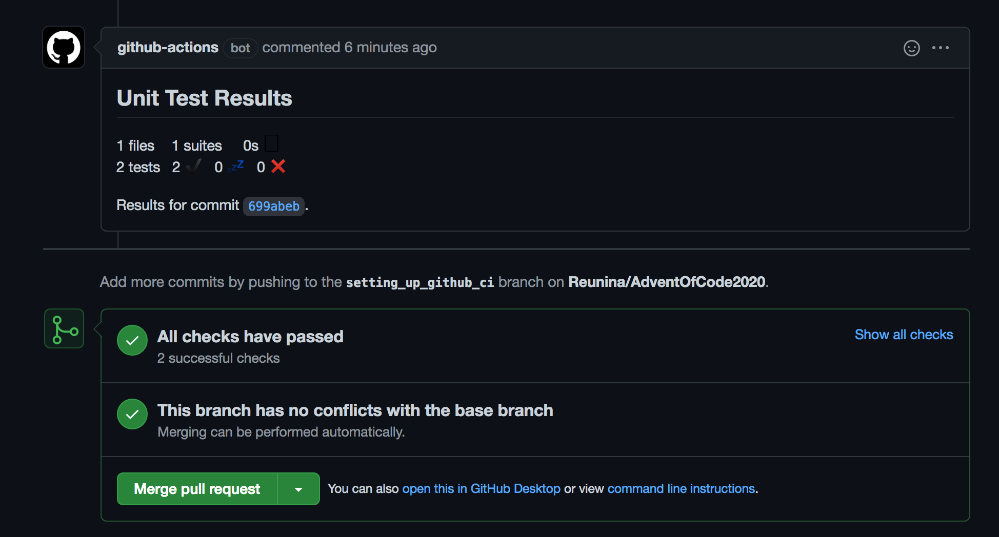

= Advent of code 2020

These are solutions for a serie aof puzzles you can find here:
 https://adventofcode.com/2020[advent of code 2020].

== Running solutions

for each day you will find a dedicated package. ( e.g package `day01` dor the puzzles of the first day).
Each will contain a `.kt` file with a `main` function.

Run this with you prefered java tool or command line.

== Github ci

A each push or pull request at the `main` branch the `github/workflows/testing.yml` is launch.

Unit tests are executed by maven and then published. When you are working on a pull request, results can be show as follow:

.Example of publishing failling tests on a PR.
[caption=""]

.Example of publishing successful tests on a PR.
[caption=""]
