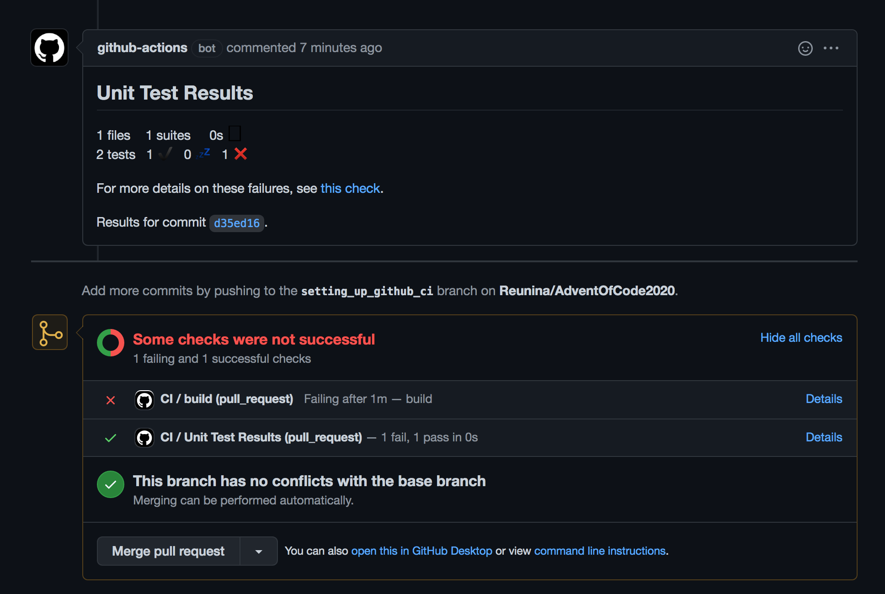
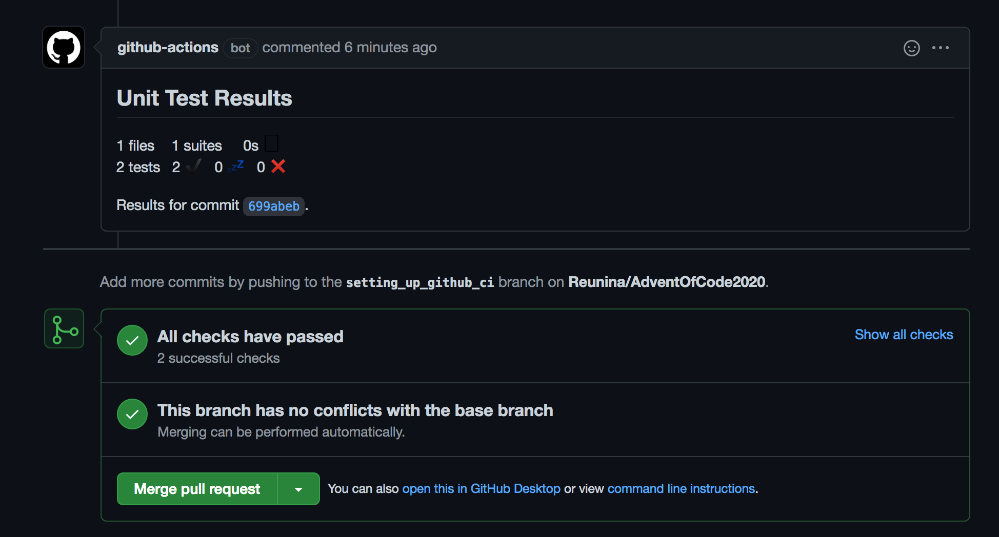
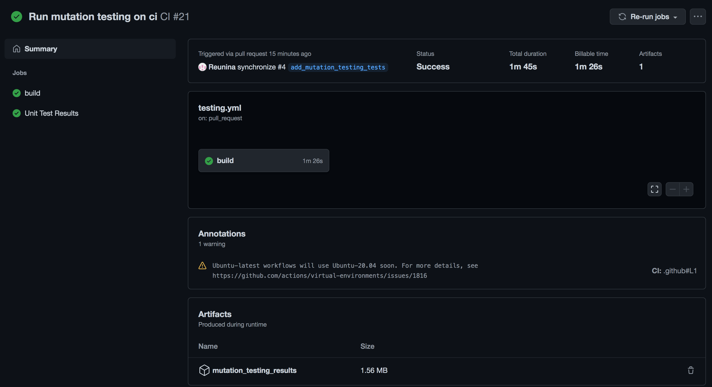

= Advent of code 2020
These are solutions for a serie of puzzles you can find here:
 https://adventofcode.com/2020[advent of code 2020].

== Technology stack

programming language::
https://kotlinlang.org/[Kotlin]

build sources::
https://maven.apache.org/[Maven]

build documentation::
https://asciidoctor.org/[Asciidoctor]

test code::
https://assertj.github.io/doc/[AssertJ] & https://pitest.org/[Pit-test]

== Running solutions

for each day you will find a dedicated package. ( e.g package `day01` for the puzzles of the first day).
Each will contain a `.kt` file with a `main` function ( `Day01.kt` for day01 puzzles, `Day02.kt` for day02 puzzles, etc.. )

Run this with you preferred java tool or command line.

== Github ci

At each push or pull request at the `main` branch the `github/workflows/testing.yml` is launch.

=== Running and publishing unit tests

Unit tests are executed by maven and then published.
When you are working on a pull request, results can be show as follow:

.Example of publishing failling tests on a PR.
[caption=""]

.Example of publishing successful tests on a PR.
[caption=""]

=== Running and archiving mutation tests

Using https://pitest.org/about/[PIT library] for running some mutation tests.

The results are archived as artifact in the action panel:

.Example of archiving mutation tests results.
[caption=""]

